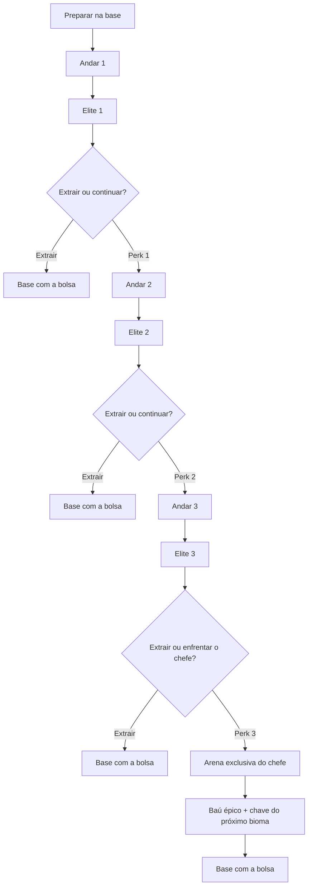

# Expedições Roguelite — Plano de implementação

Especificação do novo formato de masmorra de Snaredusk. Este documento descreve o
design aprovado para planejamento; a implementação deve seguir as etapas abaixo e
ser validada primeiro na Floresta Fúngica.

**Status:** em implementação — etapas 1 e 2 concluídas
**Escopo:** Bestiário simplificado + expedições de três andares + arena final  
**Princípio:** aumentar duração e variedade sem transformar o jogo num roguelike
pesado ou apagar o loop de base, craft e loja.

---

## 1. Problema

Hoje cada bioma cabe em uma única masmorra procedural curta: o jogador elimina ou
captura poucos monstros, abre a arena e enfrenta o chefe. O procedural muda o
layout, mas não cria decisões suficientes para sustentar novas runs.

O novo formato deve:

- criar uma expedição com começo, escalada e clímax;
- oferecer risco real entre guardar a bolsa e continuar;
- reutilizar as criaturas e comportamentos já existentes;
- dar função recorrente a loot, receitas, skins e Bestiário;
- preservar sessões de aproximadamente 20–40 minutos;
- manter apenas um companheiro ativo.

Três andares aumentam a duração de uma expedição, mas não bastam sozinhos para
garantir longevidade. A repetição também será sustentada por Bestiário, drops de
elite, receitas temáticas e combinações diferentes de perks.

---

## 2. Loop da expedição



### Regras fechadas

- Cada expedição possui três andares procedurais e uma quarta etapa de arena.
- Cada andar termina com uma criatura elite já existente.
- A espécie elite não se repete na mesma expedição.
- Após cada elite, o jogador pode extrair ou escolher um entre três perks.
- Os perks duram somente durante a expedição.
- Extrair preserva a bolsa, encerra a expedição e consome a ida à masmorra do dia.
- Continuar preserva bolsa, HP e companheiro; recupera stamina e 5% do HP máximo.
- Morrer ou abandonar perde a bolsa e todos os perks, como no risco atual.
- Uma nova ida ao mesmo bioma sempre começa no andar 1.
- O tutorial inicial continua usando sua masmorra curta e não entra neste fluxo.
- O chefe ocupa uma arena própria, sem salas comuns anexadas.
- A chave de progressão é concedida pelo baú épico do chefe, não por elites.

### Checkpoint e Continue

O jogo salva a expedição na entrada e nas transições de andar. Ao fechar e abrir o
jogo, `Continue` retoma o início do andar atual usando a mesma seed e as mesmas
opções já determinadas.

Não haverá save exato no meio de um combate. Essa decisão reduz estados quebrados,
evita serializar projéteis/inimigos e mantém os testes de save controláveis.

---

## 3. Ritmo e tamanho

Repetir três vezes a dungeon atual de 8–11 salas produziria runs longas demais. A
geração deve ser compacta e crescer gradualmente:

| Etapa | Salas | Inimigos comuns | Encerramento |
|-------|------:|-----------------:|-------------|
| Andar 1 | 5–6 | 5–7 | Elite |
| Andar 2 | 6–7 | 7–10 | Elite |
| Andar 3 | 7–8 | 9–12 | Elite |
| Arena | 1 | Apenas mecânicas/minions do chefe | Chefe |

Tipos de sala existentes continuam válidos: combate, tesouro, evento, descanso e
mercador. A garantia desses tipos passa a considerar a expedição inteira, não cada
andar isoladamente. Exemplo: não é necessário colocar um mercador em todos os
andares.

### Escalonamento inicial

Valores de partida para o vertical slice; devem ser ajustados por playtest.

| Etapa | HP inimigo | Ataque | Velocidade |
|-------|-----------:|-------:|-----------:|
| Andar 1 | ×1,00 | ×1,00 | ×1,00 |
| Andar 2 | ×1,25 | ×1,12 | ×1,04 |
| Andar 3 | ×1,55 | ×1,25 | ×1,08 |
| Chefe | ×1,25 | ×1,15 | ×1,00 |

Velocidade escala pouco para preservar leitura de animação, esquiva e hitboxes.
Defesa não recebe multiplicador global; ela continua sendo característica da
espécie e de elites específicas.

---

## 4. Elites

Elites reutilizam sprite, animações, hitbox e comportamento-base da espécie. Não
serão criados inicialmente quinze movesets individuais.

### Modificadores-base

- HP: ×1,70;
- ataque: ×1,10 antes do afixo;
- velocidade: definida pelo afixo;
- escala visual: ×1,10–1,15;
- nome com título e aura discreta;
- barra de vida própria em dourado;
- um afixo de comportamento.

### Afixos iniciais

| Afixo | Efeito | Afinidade |
|-------|--------|-----------|
| Implacável | +20% de ataque, +18% de velocidade e ataques mais frequentes | Melee |
| Tempestade | Rajada curta em leque | Ranged |
| Bastião | +3 de defesa e escudo equivalente a 40% do HP | Shielded |
| Volátil | Cria área perigosa após um ataque forte | Qualquer |
| Invocador | Invoca uma criatura fraca uma vez | Raros |

O vertical slice precisa apenas de três afixos confiáveis: Implacável, Tempestade
e Bastião. Volátil e Invocador entram depois de o núcleo estar estável.

Elites concedem recompensa melhor e podem alimentar receitas, mas não entregam
chaves de bioma.

---

## 5. Perks de expedição

Cada final de andar oferece três perks ainda não escolhidos. A seleção deve evitar
três opções da mesma categoria sempre que o pool permitir.

### Pool inicial

| ID conceitual | Nome | Efeito |
|---------------|------|--------|
| `fio_afiado` | Fio Afiado | +15% de dano da arma |
| `maos_rapidas` | Mãos Rápidas | −12% no intervalo entre ataques |
| `golpe_pesado` | Golpe Pesado | +25% dano e −10% velocidade de ataque |
| `cacador_elite` | Caçador de Elite | +20% dano contra elites e chefes |
| `casca_reforcada` | Casca Reforçada | +3 DEF |
| `segundo_folego` | Segundo Fôlego | Cura adicional ao trocar de andar |
| `passo_leve` | Passo Leve | +10% velocidade de movimento |
| `barreira_inicial` | Barreira Inicial | Escudo temporário no começo do andar |
| `laco_preciso` | Laço Preciso | Bônus na chance de captura |
| `orbe_persistente` | Orbe Persistente | Chance de recuperar orbe após falha |
| `vinculo_feroz` | Vínculo Feroz | Companheiro causa mais dano |
| `guardiao` | Guardião | Companheiro recebe menos dano |

Os modificadores devem ser calculados por um sistema central de expedição. A
implementação não deve espalhar verificações de perk diretamente por toda a
`DungeonScene`.

### Fora do escopo inicial

- árvore permanente de perks;
- moeda roguelite adicional;
- raridades ou upgrades de perk;
- reroll pago das três escolhas;
- dois companheiros simultâneos.

---

## 6. Arena final

Cada chefe terá um layout manual e reconhecível:

- entrada e enquadramento próprios;
- obstáculos posicionados para o moveset do chefe;
- props do bioma compostos manualmente;
- espaço seguro suficiente para jogador, companheiro e minions;
- intro, HUD, segunda fase e portal já existentes;
- piso e bordas visualmente distintos sem mudar a linguagem do bioma.

Primeira entrega: composição exclusiva reutilizando o tileset atual. Um atlas
inteiramente novo para cada arena só será feito depois de validar jogabilidade e
proporções.

---

## 7. Bestiário simplificado

O Bestiário é a primeira etapa de implementação porque já existe
`GameState.bestiary` e não exige nova progressão de save.

### Escopo da primeira versão

- tela com fechamento por `×`, seguindo o padrão dos outros menus;
- abas Floresta, Cristal e Termal;
- seis posições por bioma;
- silhueta e `???` para criatura ainda não registrada;
- sprite, nome e dados ao registrar a criatura;
- progresso por bioma e total (`4/6`, `12/18`);
- acesso na base e pelo inventário, sem cobrir a jogabilidade permanentemente.

### Dados revelados

- sprite e nome;
- função de combate;
- HP, ATK e DEF base;
- drops associados;
- produção no cercado;
- disponibilidade como companheiro.

O registro continua acontecendo pela captura. Chefes também podem ser revelados
ao serem derrotados para não exigir uma captura específica apenas para completar
o catálogo.

### Adiado

- bônus de +5% por família completa;
- recompensa de 100%;
- textos extensos de lore;
- filtros avançados e busca.

---

## 8. Estado e arquitetura

Modelo conceitual; os nomes finais podem mudar durante a implementação:

```ts
interface ActiveExpedition {
  biomeId: BiomeId;
  seed: number;
  floor: 1 | 2 | 3 | 4;
  phase: 'exploring' | 'reward' | 'boss';
  perks: PerkId[];
  perkOffers: PerkId[];
  defeatedEliteSpecies: string[];
  checkpointHp: number;
  checkpointStamina: number;
  checkpointBag: (BagEntry | null)[];
}
```

O gerador passa a receber um contexto:

```ts
interface DungeonGenerationContext {
  biomeId: BiomeId;
  floor: 1 | 2 | 3;
  seed: number;
  includeBoss: false;
}
```

A arena usa um gerador/layout separado. O código atual de chefe não deve continuar
acoplado a todos os andares comuns.

### Regras de save

- nova versão de save com migração segura;
- saves antigos entram sem expedição ativa;
- seed, andar, perks e ofertas ficam persistidos;
- extração, morte, abandono ou vitória limpam `activeExpedition`;
- dados inválidos descartam somente a expedição, não o save inteiro;
- bolsa continua no `GameState` atual;
- testes cobrem round-trip, migração e corrupção.

---

## 9. Etapas de implementação

Cada etapa só começa quando a anterior estiver validada.

### Etapa 1 — Bestiário simplificado — concluída

**Objetivo:** transformar o registro existente em uma meta visível.

- [x] Definir dados de exibição por espécie.
- [x] Criar modal e navegação por bioma.
- [x] Renderizar silhuetas e criaturas descobertas.
- [x] Mostrar progresso por bioma e total.
- [x] Registrar chefe ao derrotá-lo.
- [x] Integrar abertura/fechamento e responsividade.
- [x] Adicionar testes de progresso e conteúdo bloqueado.

**Aceite:** as 18 posições aparecem corretamente; capturas antigas do save são
respeitadas; uma criatura nova é revelada sem recarregar o jogo.

### Etapa 2 — Fundação da expedição — concluída

**Objetivo:** criar estado, save e ciclo de vida sem alterar ainda o combate.

- [x] Adicionar `ActiveExpedition` ao estado.
- [x] Migrar e validar o novo save.
- [x] Criar início, retomada, extração, morte e abandono.
- [x] Travar seed e andar no Continue.
- [x] Separar resultado da expedição do retorno comum à base.
- [x] Testar todos os caminhos de limpeza/retomada.

**Aceite:** fechar o navegador numa transição e usar Continue restaura a mesma
expedição; nenhum caminho deixa perks ou andar presos no save.

**Validação:** save v10 com migração v1–v9; checkpoint copia bolsa, HP e stamina
do início do andar; alterações no meio da sala não sobrescrevem esse checkpoint.
Smoke test no Chrome confirmou retomada com a mesma seed e abandono limpando a
expedição antes do retorno à base.

### Etapa 3 — Vertical slice da Floresta

**Objetivo:** validar a experiência inteira em um único bioma.

- [x] Gerar três andares compactos sem chefe.
- [x] Criar elite final por andar e impedir repetição.
- [x] Implementar Implacável, Tempestade e Bastião.
- [x] Aplicar escalonamento de andar.
- [x] Criar tela de extração/continuação.
- [x] Implementar os 12 perks iniciais.
- [x] Criar arena manual do Rei das Esporas.
- [ ] Entregar chave somente no baú épico.

**Recorte estrutural concluído:** a Floresta gera 5–6, 6–7 e 7–8 salas nos
andares 1–3, com respectivamente 5–7, 7–10 e 9–12 inimigos. Ao limpar o estágio,
uma passagem provisória desperta no centro de uma sala de combate aleatória,
reservada sem evento, baú ou perigo ambiental. Um anúncio comunica a abertura e
a sala fica marcada em ciano no minimapa. Ao usar o portal, o jogador escolhe
entre extrair a bolsa em segurança ou receber uma entre três bênçãos e avançar.
Prosseguir cria o checkpoint seguinte, recupera 5% do HP e restaura a stamina;
Segundo Fôlego acrescenta mais 5% de cura. As ofertas permanecem fixas no save.
Baús abertos somem após uma breve pausa para não acumular ruído visual nas salas
já exploradas.

Cada andar agora reserva uma espécie diferente para o confronto elite. Ela
desperta no centro da sala marcada somente depois que todas as criaturas comuns
forem resolvidas, evitando que o encerramento seja consumido por acidente no
meio da exploração. Nome, barra dourada, aura e anúncio identificam o afixo:
Implacável acelera o ritmo de combate, Tempestade lança uma rajada em leque e
Bastião acrescenta defesa e escudo.

O pool inicial de doze perks está conectado ao jogo. Além de Fio Afiado, Mãos
Rápidas, Casca Reforçada, Segundo Fôlego, Passo Leve, Vínculo Feroz e Guardião,
Golpe Pesado troca cadência por dano, Caçador de Elite amplia o dano do jogador
contra elites e chefes, Barreira Inicial concede 20 pontos de escudo a cada
andar, Laço Preciso soma 10 pontos percentuais à captura e Orbe Persistente tem
35% de chance de devolver o Orbe após uma falha. A barreira possui leitura
própria na HUD e todos os efeitos são derivados pelo sistema central de perks.

O mercador ambulante também oferece uma compra única de cura por encontro. O
Elixir do Caminhante recupera de 5% a 10% do HP máximo e custa uma fração
aleatória de 20% a 40% do ouro atual, com piso acima do pacote de três Orbes para
continuar sendo o item mais caro da lista.

**Aceite:** uma run completa da Floresta dura aproximadamente 25–40 minutos, pode
ser extraída em três pontos, não apresenta softlock e continua legível com
companheiro, elite e props.

### Etapa 4 — Balanceamento da Floresta

**Objetivo:** provar o loop antes de replicá-lo.

- [ ] Medir duração de cada andar.
- [ ] Validar ocupação média da bolsa.
- [ ] Medir dano recebido e taxa de morte.
- [ ] Verificar valor de extração por andar.
- [ ] Ajustar multiplicadores, cura e recompensas.
- [ ] Testar diferentes armas e pelo menos três companheiros.

**Aceite:** extrair cedo e continuar são decisões válidas; nenhuma arma ou perk
torna o chefe trivial; a bolsa cria pressão sem ficar cheia sempre no andar 1.

### Etapa 5 — Cristal e Termal

**Objetivo:** aplicar a estrutura validada aos outros biomas.

- [ ] Definir pools de elite sem repetição por bioma.
- [ ] Adaptar afixos aos hazards de Cristal e Termal.
- [ ] Criar arena manual da Matriarca Prismática.
- [ ] Criar arena manual da Salamandra Anciã.
- [ ] Integrar as chaves e desbloqueios existentes.
- [ ] Validar sprites grandes, hitboxes e navegação do companheiro.

**Aceite:** os três biomas compartilham regras, mas mantêm identidade visual,
hazards e escolhas de combate próprias.

### Etapa 6 — Conteúdo recorrente e longevidade

**Objetivo:** fazer reruns alimentarem o restante do jogo.

- [ ] Definir drops de elite.
- [ ] Ligar drops a receitas temáticas sem criar inflação.
- [ ] Revisar conclusão do Bestiário.
- [ ] Avaliar níveis de perigo após derrotar cada chefe.
- [ ] Rodar novamente a simulação econômica de dez ciclos.

**Aceite:** repetir um bioma já concluído possui pelo menos duas metas claras além
de ouro: Bestiário, receita, skin ou drop de elite.

### Etapa 7 — QA e release

- [ ] Novo jogo → três biomas → três chefes.
- [ ] Continue em todos os limites de andar.
- [ ] Extração, morte e abandono em cada etapa.
- [ ] Saves antigos e saves corrompidos.
- [ ] Seeds determinísticas e geração sem softlock.
- [ ] Teste visual das três arenas.
- [ ] Teste de performance com fog, props, elite e companheiro.

**Aceite:** suíte automatizada verde e playtest completo sem bloqueadores.

---

## 10. Métricas de validação

| Métrica | Alvo inicial |
|---------|--------------|
| Expedição completa | 25–40 min |
| Andar 1 | 6–10 min |
| Andar 2 | 7–11 min |
| Andar 3 | 8–12 min |
| Arena | 4–7 min |
| Ofertas de perk | 3 distintas |
| Elites repetidas na run | 0 |
| Softlocks em 100 seeds por andar | 0 |

A meta de 8–12 horas totais só será considerada atendida após playtest completo.
O número de andares, isoladamente, não será usado como prova de longevidade.

---

## 11. Decisões futuras

Questões que devem esperar o vertical slice:

- níveis de perigo para biomas já concluídos;
- custo ou limite de extrações;
- drops exclusivos por afixo de elite;
- bônus mecânico por completar uma família do Bestiário;
- tileset inteiramente novo para cada arena;
- atalhos permanentes entre andares.

Sentinelas permanecem fora deste escopo. O jogo continua projetado para um único
companheiro ativo e uma leitura de combate limpa.
