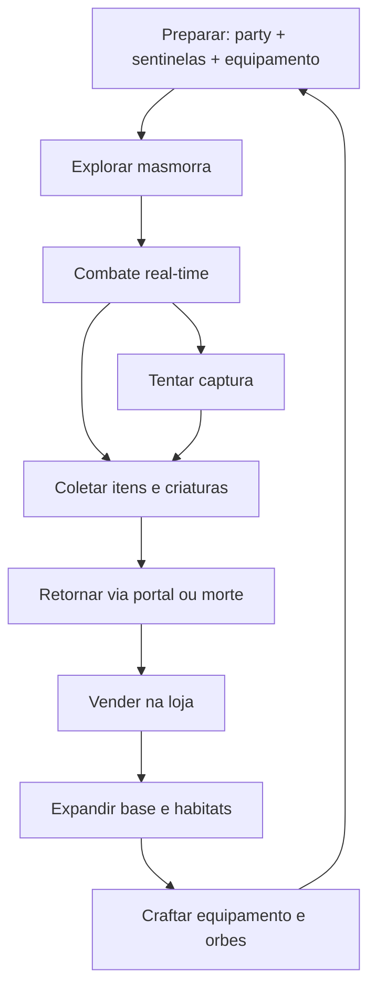
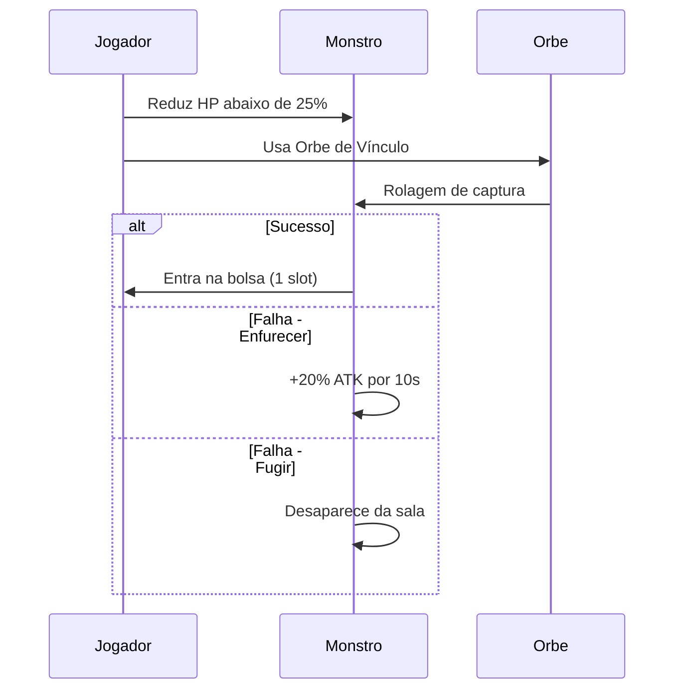

# GDD — Snaredusk

Documento mestre de design. Versão 0.2 — alinhado ao build `v0.5.0`.

> **Build jogável:** [lochesystem.github.io/snaredusk/](https://lochesystem.github.io/snaredusk/) — ver [CHANGELOG.md](../CHANGELOG.md).

---

## 0. Estado da implementação (build atual)

Tabela de referência rápida: o que o **código de hoje** faz vs. o que este GDD descreve como **meta MVP**. Detalhes de release em [ROADMAP.md](ROADMAP.md) e [CHANGELOG.md](../CHANGELOG.md).

**Versão:** `v0.5.0` (2026-07-23)

| Área | Implementado (v0.5) | Meta GDD (MVP) |
|------|------------------------|----------------|
| **Biomas** | 3 — Floresta, Cristal, Termal + chefes | 3 com chefes |
| **Masmorra** | 8–11 salas procedural, 6 tipos de sala, layout fullscreen | 8–14 salas + tipos |
| **Obstáculos / decor** | Rochas, buracos, props por bioma, hazards | Hazards por bioma |
| **Baús** | Raros na masmorra, tecla E | Salas tesouro + armadilhas |
| **Portal** | Ativa após limpar inimigos; landmarks movíveis na base | Custo escalonado por uso na run |
| **Minimapa** | Sim (explorado + portal) | Sim (+ salas secretas com sentinela) |
| **Criaturas** | 12 espécies (9 capturáveis + 3 chefes); sprites v1+ | 18 catalogadas |
| **Captura** | Orbe Q, taxa por HP, mira de alcance | Igual + upgrades e tipos |
| **Party / sentinelas** | 1 companheiro com IA | 2 companheiros + 1 sentinela/bioma |
| **Loja** | 5 níveis, 6 arquétipos, 4 faixas, reputação 1–3, tileset visual, clientes animados | 5 níveis, 6 arquétipos, 4 faixas |
| **Base** | Grid escavável, estações rotacionáveis (R), craft adjacente, habitat com cercados | Escavação, oficina, craft, baús |
| **Ciclo dia/noite** | Cama, 1 masmorra/dia, produção habitat ao dormir | Dormir, loja diurna, evento entardecer |
| **Craft / economia** | 2 receitas, compra de orbes, reputação | 20 receitas, sinks de ouro |
| **Tutorial** | Mira: masmorra → habitat → loja → orbes (skippável) | 15 min guiado |
| **Save** | localStorage v7+ (tutorial, reputação, biomas) | Igual + progresso por bioma |
| **Áudio** | SFX Web Audio + música por bioma | SFX + 4 tracks finais |
| **Arte** | Sprites v2 player/base/loja; tilesets bioma 1–3 | Sprites pintados + normal maps |

**Regra:** seções abaixo descrevem o **design alvo**. Onde não houver nota, assuma “ainda não implementado” ou ver tabela acima.

---

## Índice

1. [Visão geral](#1-visão-geral)
2. [Core gameplay loop](#2-core-gameplay-loop)
3. [Masmorra](#3-masmorra)
4. [Combate](#4-combate)
5. [Captura de criaturas](#5-captura-de-criaturas)
6. [Party e sentinelas](#6-party-e-sentinelas)
7. [Loja](#7-loja)
8. [Base subterrânea](#8-base-subterrânea)
9. [Crafting e economia](#9-crafting-e-economia)
10. [Progressão e metas](#10-progressão-e-metas)
11. [Narrativa e mundo](#11-narrativa-e-mundo)
12. [Conteúdo MVP — catálogo](#12-conteúdo-mvp--catálogo)
13. [Áudio](#13-áudio)
14. [Arquitetura técnica](#14-arquitetura-técnica)
15. [Non-goals e riscos](#15-non-goals-e-riscos)

---

## 1. Visão geral

### Elevator pitch

Você é um caçador-mercador que explora cavernas à noite, captura criaturas vivas e as vende (ou treina) de dia na sua loja subterrânea. Cada monstro capturado pode lutar ao seu lado, gerar renda passiva e alterar biomas inteiros com habilidades ambientais — enquanto você expande sua base como um refúgio vivo no subsolo.

### Público-alvo

- Jogadores de Moonlighter, Stardew Valley, Core Keeper, Pokémon
- Idade: 13+
- Plataforma: **navegador desktop** (mouse + teclado). Sem mobile ou touch.
- Sessão típica: 20–40 minutos

### Pilares de design

| Pilar | Significado | Exemplo de corte de escopo |
|-------|-------------|---------------------------|
| **Risco vs. recompensa** | Morte na masmorra dói, mas não apaga progresso permanente | Sem perma-death de criaturas na base |
| **Criaturas como recurso vivo** | Mesmo monstro = loot, aliado, sentinela, mercadoria | Sem sistema de breeding complexo no MVP |
| **Cozy profundidade** | Base relaxante; masmorra tensa | Sem punição severa por loja mal decorada |

### Referências e o que copiamos de cada uma

| Jogo | O que absorvemos | O que NÃO copiamos |
|------|------------------|-------------------|
| Moonlighter | Loop dia/noite, precificação por reação, bolsa com risco | Estrutura de 4 masmorras + 5ª final idêntica |
| Core Keeper | Base escavável, craft com baús adjacentes, farming | Multiplayer, combate de chefes massivo |
| Stardew Valley | Perspectiva oblíqua cozy, ritmo diário | Romance, festivais extensos |
| Pokémon | Captura, party, tipos, bestiário | 150+ espécies, batalhas turn-based puras |

---

## 2. Core gameplay loop

### Macro-loop (sessão)



### Micro-loop (30 segundos)

1. Mover pelo ambiente (esquivar projéteis/armadilhas)
2. Atacar inimigo com arma melee ou habilidade
3. Companheiros atacam automaticamente
4. Decidir: matar (drop garantido) ou enfraquecer e capturar (risco/recompensa)
5. Coletar drop na bolsa (slot limitado)

### Ciclo dia/noite

| Fase | Trigger | Duração | Atividades |
|------|---------|---------|------------|
| **Noite** | Jogador entra na masmorra | Ilimitada | Exploração, combate, captura |
| **Amanhecer** | Portal manual ou auto após X salas | Instantâneo | Masmorra fecha; salva progresso de bioma |
| **Dia** | Jogador acorda na base | Ilimitada | Loja, construção, habitats, craft |
| **Entardecer** | Após 1 ciclo de loja aberta OU timer opcional | 2–5 min evento | Visitante especial ou +15% preço em raros |

**Regra (MVP implementado):** o dia avança ao **dormir na cama** (após voltar da masmorra) ou ao **fechar a loja** após um dia de vendas. **Uma ida à masmorra por dia** — não dá para dormir nem farmar produção sem explorar primeiro.

### Estados do jogador

| Estado | Onde | Bolsa | Companheiros |
|--------|------|-------|--------------|
| Na base | Hub seguro | Acessível | Todos no habitat |
| Na masmorra | Combate ativo | Limitada (12 slots) | Party ativa (2–3) |
| Na loja | Modo gerenciamento | Depósito da loja | Gaiolas na prateleira |
| Morto | Teletransporte à base | **Perdida** | Retornam exaustos ao habitat |

---

## 3. Masmorra

### Estrutura geral

- **3 biomas** no MVP, cada um com tema visual, inimigos, loot e criaturas exclusivas
- Salas conectadas por **grafo procedural** (não labirinto infinito)
- Cada run gera 8–14 salas + sala de chefe
- Progresso **persistente por bioma**: chefes derrotados, atalhos e sentinelas permanecem

**Cenário (técnico):** salas usam tileset 32×32 com paredes em faixas de 14 px — ver [wall-tiles.md](wall-tiles.md).

### Tipos de sala

| Tipo | Frequência | Conteúdo |
|------|------------|----------|
| **Combate** | 50% | 2–5 inimigos, drops |
| **Tesouro** | 15% | Baú com loot; pode ter armadilha |
| **Evento** | 10% | Escolha narrativa (HP, ouro, item) |
| **Descanso** | 10% | Cura 25% HP; sem inimigos |
| **Loja ambulante** | 5% | NPC vende orbes e poções por ouro |
| **Chefe** | 1 por run (final) | Mini-boss do bioma |

### Bolsa

| Propriedade | Valor |
|-------------|-------|
| Slots base | 12 |
| Upgrade máximo | 20 (via upgrade de base) |
| Criatura capturada | Ocupa 1 slot |
| Stack de itens | Até 99 por slot (itens iguais empilham) |
| Morte | Perde **toda** a bolsa |
| Portal de retorno | Mantém bolsa; custa ouro |

### Portal de retorno

| Uso no bioma | Custo (ouro) |
|--------------|--------------|
| 1ª vez na run | 0 (tutorial) |
| 2ª vez | 50 |
| 3ª vez | 100 |
| N-ésima | 50 × (N − 1) |

### Biomas MVP

#### Bioma 1 — Floresta Fúngica (desbloqueado no início)

- **Tema:** musgo, cogumelos bioluminescentes, árvores retorcidas
- **Hazard:** esporos (veneno leve em áreas sem tocha)
- **Chefe:** **Rei das Esporas** — invoca adds, weak point quando HP < 40%
- **Desbloqueio:** nenhum (tutorial)
- **Habitat exclusivo:** Viveiro de Musgo

#### Bioma 2 — Caverna de Cristal (após chefe 1)

- **Tema:** cristais, reflexos, chão escorregadio
- **Hazard:** lascas de cristal (dano ao correr)
- **Chefe:** **Matriarca Prismática** — reflete projéteis
- **Desbloqueio:** chave de esporo (drop do chefe 1)
- **Habitat exclusivo:** Cristaleira

#### Bioma 3 — Pântano Termal (após chefe 2)

- **Tema:** vapor, poças termais, rochas quentes
- **Hazard:** lava/lodo (dano por segundo sem sentinela ou resistência)
- **Chefe:** **Salamandra Anciã** — ondas de calor em área
- **Desbloqueio:** chave prismática (drop do chefe 2)
- **Habitat exclusivo:** Banho Termal

### Geração procedural (regras)

```
run = {
  rooms: 8 + random(0, 6),
  layout: "branching_tree",  // 1 entrada, 1 chefe, 1–3 ramificações
  combat_weight: 0.5,
  guarantee: [1 treasure, 1 rest, 1 event],
  boss_room: always_last
}
```

- Salas secretas: 15% chance por ramo se sentinela **Lumimorcego** estiver ativa
- Dificuldade escala por **nível do bioma** (1–5), não por run infinita

---

## 4. Combate

### Modelo

- **Real-time action** top-down oblíquo (não turn-based)
- Câmera segue jogador com leve lookahead na direção do movimento
- Sem stamina de ataque; stamina só para **esquiva** (dash)

### Jogador

| Stat | Base | Máximo (upgrades) |
|------|------|-------------------|
| HP | 100 | 200 |
| Stamina | 80 | 120 |
| ATK (arma) | 10–25 | 50 |
| DEF | 5 | 30 |
| Velocidade | 120 px/s | 160 px/s |
| Esquiva | 0.3s invencibilidade, custo 20 stamina | — |

### Armas (melee)

| Tier | Exemplo | ATK | Velocidade | Craft |
|------|---------|-----|------------|-------|
| 1 | Faca enferrujada | 10 | Rápida | Inicial |
| 2 | Picareta de combate | 18 | Média | Ferro + madeira |
| 3 | Lâmina de cristal | 28 | Média | Cristal + ferro |
| 4 | Garra fúngica | 35 | Rápida | Esporo raro + madeira |
| 5 | Martelo térmico | 45 | Lenta | Escama salamandra + ferro |

### Habilidade especial (slot único)

- Cooldown: 8–15s conforme habilidade
- Exemplos: onda de choque (8 dmg área), rede de captura (+20% captura 5s), cura 15 HP
- Desbloqueadas via craft na oficina

### Companheiros em combate

| Propriedade | Valor |
|-------------|-------|
| Slots ativos (MVP início) | 2 |
| Slots máximos | 3 (upgrade **Pátio de Companheiros**) |
| IA | Segue jogador (offset lateral); ataca inimigo mais próximo |
| Habilidade | Automática em cooldown |
| Morte em combate | **Exaustão** — indisponível até retorno à base + 1 ciclo de descanso |
| XP | Companheiros ganham XP por dano causado; level 1–10 |

### Tipos elementais

Ciclo de vantagem: **Fogo → Natureza → Água → Fogo**

| Tipo | Forte contra | Fraco contra | Cor UI |
|------|--------------|--------------|--------|
| Fogo | Natureza (+25% dmg) | Água (−25%) | `#e85d4a` |
| Natureza | Água | Fogo | `#5dbb63` |
| Água | Fogo | Natureza | `#4a9fe8` |
| Neutro | — | — | `#a0a0a0` |
| Luz | Sombra (+25%) | — | `#f0d060` |
| Sombra | — | Luz (−25%) | `#6b4a8a` |

### Fórmulas de dano

```
dano_final = max(1, (ATK_atacante - DEF_alvo * 0.5)) * multiplicador_tipo * crit
crit_chance = 5% base + bônus de equipamento
```

Números flutuantes na tela: branco (normal), amarelo (crítico), verde (cura), azul (resistido).

---

## 5. Captura de criaturas

### Fluxo



### Condições

| Condição | Efeito |
|----------|--------|
| HP do alvo ≤ 25% | Obrigatório para tentar captura |
| Orbe de Vínculo no inventário | Consumido na tentativa (sucesso ou falha) |
| Alvo é "capturável" | Flag por espécie; chefes = não capturáveis no MVP |
| Party cheia na bolsa | Bloqueia captura (UI avisa) |

### Taxa de captura

```
taxa = taxa_base + bonus_orbe + bonus_sentinela + bonus_habilidade - penalidade_raridade

taxa_base     = 30%
bonus_orbe    = 0% (básico) | +15% (reforçado) | +30% (raro)
bonus_sentinela = até +10% se sentinela do bioma for tipo compatível
bonus_habilidade = +20% se rede de captura ativa
penalidade_raridade = 0% (comum) | −5% (incomum) | −15% (raro) | −30% (lendário)
```

### Resultado da falha (distribuição)

| Resultado | Chance |
|-----------|--------|
| Enfurecer | 60% |
| Fugir | 30% |
| Segunda chance (orbe não consumido) | 10% (só com orbe básico) |

### Raridade

| Raridade | Cor | Slots passivo | Preço base loja | Taxa captura mod |
|----------|-----|---------------|-----------------|------------------|
| Comum | Branco | 0 | 40–80 ouro | 0% |
| Incomum | Verde | 1 | 100–180 ouro | −5% |
| Raro | Azul | 1 | 250–400 ouro | −15% |
| Lendário | Dourado | 2 | 600–1000 ouro | −30% |

### Pós-captura

1. Criatura vai para **bolsa** (ocupa slot)
2. Na base: depositar em **habitat** (produção passiva) ou **gaiola de loja** (venda)
3. Criaturas em habitat têm **humor** (0–100) e **fome** — afetam produção e preço

---

## 6. Party e sentinelas

### Party de combate

- Escolhida no **Painel de Companheiros** antes de entrar na masmorra
- Máximo 2 (início) ou 3 (com upgrade)
- Criatura em party **não** pode ser sentinela simultaneamente

### Sentinelas de bioma

Monstros atribuídos como **Sentinela** ficam no habitat mas aplicam passivo **em todo o bioma** correspondente.

| Regra | Valor |
|-------|-------|
| Sentinelas simultâneas (MVP) | 1 por bioma |
| Trocar sentinela | Grátis na base; custa 1 ciclo de descanso da criatura |
| Sentinela exausta | Passivo desativado até descanso |

### Tabela de sentinelas MVP (exemplos)

| Criatura | Bioma | Passivo |
|----------|-------|---------|
| Lumimorcego | Floresta Fúngica | Revela salas secretas no minimapa |
| Carapaça de Musgo | Floresta Fúngica | +15% DEF do jogador |
| Esporo Dorminhoco | Floresta Fúngica | 10% inimigos comuns não agredem |
| Prismarin | Caverna de Cristal | +20% ouro em baús |
| Eco de Quartzo | Caverna de Cristal | Reflete 10% do dano recebido ao atacante |
| Lumicascalho | Caverna de Cristal | Ilumina salas sem tocha |
| Salamandra | Pântano Termal | Imunidade a dano de lava/lodo |
| Vaporoso | Pântano Termal | +10% taxa de captura |
| Caranguejo Termal | Pântano Termal | Regenera 2 HP/s fora de combate |

---

## 7. Loja

### Conceito

Loja subterrânea herdada — de dia, clientes descem ao refúgio para comprar loot e criaturas. Inspirada em Moonlighter: precificação é gameplay.

### Modos da loja

| Modo | Ação do jogador |
|------|-----------------|
| **Gerenciamento** | Colocar itens/criaturas nas prateleiras, definir preços, decorar |
| **Balcão** | Ficar atrás do balcão; clientes trazem item; jogador confirma venda |
| **Fechada** | Montar layout, craft, organizar depósito |

### Prateleiras

| Upgrade loja | Slots prateleira | Gaiolas vivas | Display premium |
|--------------|------------------|---------------|-----------------|
| Nível 1 | 6 | 1 | 0 |
| Nível 2 | 10 | 2 | 1 |
| Nível 3 | 14 | 3 | 2 |
| Nível 4 | 18 | 4 | 3 |
| Nível 5 | 24 | 6 | 4 |

**Display premium:** +25% no teto de preço "perfeito" para o item exposto.

### Precificação (sistema Moonlighter adaptado)

Cada item tem um **Valor Base** oculto até descobrir:

```
valor_base = tabela_item[id] * (1 + 0.1 * nivel_bioma)
```

Faixas de reação do cliente (proporção do valor base):

| Reação | Emoji | Faixa de preço | Efeito |
|--------|-------|----------------|--------|
| **Barganha** | 😄 | < 70% do base | Compra rápido; você perde lucro |
| **Perfeito** | 😊 | 90–110% do base | Lucro ideal; popularidade estável |
| **Caro** | 😐 | 110–145% do base | Compra relutante; −5 popularidade |
| **Recusa** | 😠 | > 145% do base | Não compra; −10 popularidade se 2 recusas seguidas |

**Popularidade** por item (0–100): começa em 50; vendas repetidas no mesmo dia −3; dia sem vender +2.

```
preco_perfeito_max = valor_base * (1 + 0.25 * (popularidade/100)) * bonus_display
```

### Criaturas vivas na loja

- Ficam em **gaiola animada** na prateleira
- **Fome:** se não alimentadas por 1 ciclo de dia, humor −20
- **Humor** afeta preço: ±20% do valor base
- Crianças pagam +30% por criaturas "fofas" (tag `cute`)
- Colecionadores pagam +40% por raros/lendários

### Arquétipos de cliente (MVP)

| Tipo | Comportamento | Frequência |
|------|---------------|------------|
| **Morador** | Preço médio; compra itens comuns | 40% |
| **Minerador** | Prefere minérios e gemas; +10% orçamento | 20% |
| **Colecionador** | Busca raros; ignora comuns | 10% |
| **Criança** | Prefere criaturas fofas; orçamento baixo | 15% |
| **Rico** | Aceita preços altos; 2× orçamento | 10% |
| **Mercador viajante** | Compra em volume com desconto 15%; vende orbes | 5% (evento) |

### Regra do balcão

- Cliente coloca item no balcão
- Jogador deve estar **atrás do balcão** e pressionar **E** em 8s
- Se demorar: cliente paga **50%** e leva o stack inteiro (frustração + feedback sonoro)

---

## 8. Base subterrânea

### Conceito

Hub persistente estilo Core Keeper: escave, construa, organize. Zona segura — sem spawn de inimigos se **iluminação ≥ 60%** na área.

### Grid

| Propriedade | Valor |
|-------------|-------|
| Célula | 32×32 px lógicos (tile oblíquo 64×32 no chão) |
| Área inicial | 20×20 células pré-escavadas |
| Expansão | Picareta em rocha adjacente (custo stamina 5/célula) |
| Profundidade máxima MVP | 3 camadas verticais (níveis Z) |

### Zonas

| Zona | Função | Estação |
|------|--------|---------|
| **Entrada / Loja** | NPCs, balcão, prateleiras | — |
| **Habitat** | Alojar criaturas; produção passiva | Comedouro |
| **Oficina** | Craft armas, orbes, ferramentas | Bancada, Forja |
| **Jardim de fungos** | Cultivar ingredientes | Hoe + Regador |
| **Armazém** | Baús; materiais para craft adjacente | Baús (4 tipos) |
| **Quarto** | Dormir = avançar dia; salvar | Cama |
| **Pátio de companheiros** | Upgrade party para 3 | — |

### Produção passiva (habitat)

| Criatura (exemplo) | Recurso / ciclo dia | Quantidade |
|--------------------|---------------------|------------|
| Lumimorcego | Pó bioluminescente | 2 |
| Carapaça de Musgo | Fibra de musgo | 3 |
| Prismarin | Fragmento de cristal | 1 |
| Salamandra | Escama termal | 1 |
| Vaporoso | Condensado | 2 |

Fórmula (MVP): `producao = base` (humor fixo 100%). Fórmula completa: `producao = base * (humor/100) * (1 + 0.05 * nivel_criatura)`

### Iluminação

| Fonte | Raio | Combustível |
|-------|------|-------------|
| Tocha | 4 células | 1 madeira / 2 ciclos dia |
| Cristal luminescente | 6 células | Permanente (craft) |
| Lumimorcego em habitat | +2 células ao redor | Grátis |

Área com iluminação < 40%: evento negativo 5% por ciclo (ladrão, criatura triste, −10 humor global).

### Craft adjacente (padrão Core Keeper)

- Estações de craft puxam materiais de **baús nas 4 células cardinais adjacentes**
- UI mostra preview do que será consumido antes de confirmar

---

## 9. Crafting e economia

### Moedas e recursos

| Recurso | Fonte | Uso principal |
|---------|-------|---------------|
| **Ouro** | Loja, baús | Upgrades, portal, compras NPC |
| **Madeira** | Bioma 1, jardim | Construção, tochas |
| **Ferro** | Bioma 1–2 | Armas, ferramentas |
| **Cristal** | Bioma 2 | Orbes reforçados, decoração |
| **Essência térmica** | Bioma 3 | Armas tier 5, resistência |
| **Ingredientes de criatura** | Produção passiva | Orbes, comida |

### Receitas MVP (amostra)

| Item | Materiais | Estação |
|------|-----------|---------|
| Orbe de Vínculo (básico) | 2 fibra + 1 pó luminescente | Bancada |
| Orbe Reforçado | 1 orbe básico + 2 cristal | Bancada |
| Tocha | 1 madeira + 1 fibra | In-hand |
| Picareta de combate | 3 ferro + 2 madeira | Forja |
| Comedouro | 4 madeira + 2 ferro | Bancada |
| Gaiola de loja | 6 ferro + 2 cristal | Forja |
| Cristal luminescente | 4 fragmento cristal + 2 pó | Bancada |

### Sink de ouro (evitar inflação)

- Portal de retorno (escalante)
- Upgrades de loja (150 → 500 → 1200 → 3000 → 8000 ouro)
- Decoração premium (cosmético + bônus pequeno de reputação)
- Taxa do mercador viajante (5% em compras)

---

## 10. Progressão e metas

### Curva de progressão (horas)

| Hora | Marco |
|------|-------|
| 0–1 | Tutorial: 1ª captura, 1ª venda, 1º habitat |
| 1–3 | Chefe bioma 1; loja nível 2 |
| 3–6 | Bioma 2 desbloqueado; sentinelas |
| 6–10 | Chefe bioma 2; oficina tier 2 |
| 10–12 | Bioma 3; loja nível 4; party de 3 |

### Bestiário

- 18 espécies no MVP
- Registrar captura = entrada no bestiário
- **Família completa** (6 do mesmo bioma): +5% taxa de captura naquele bioma
- **Bestiário 100%**: título cosmético + orbe raro grátis

### Reputação

| Nível | Requisito | Benefício |
|-------|-----------|-----------|
| 1 | Início | Clientes básicos |
| 2 | 500 ouro vendido | +1 slot display |
| 3 | 2000 ouro | Colecionador aparece mais |
| 4 | Chefe 2 morto | Mercador viajante desbloqueado |
| 5 | Bestiário 50% | +10% valor base em todos os itens |

---

## 11. Narrativa e mundo

### Premissa

O subsolo abriga uma rede de vilas esquecidas. Você chega a **Brumavale**, vila em ruínas, e herda a loja de um mercador desaparecido. Um NPC mentor (**Mira**, aprendiz de bióloga) explica que criaturas do subsolo são simultaneamente mercadoria valiosa, aliados e chaves ecológicas dos biomas.

### Tom

- Cozy com tensão leve; humor seco nas falas de Mira
- Sem profecias épicas no MVP; mistério da "Câmara do Véu" (conteúdo pós-MVP) mencionado em diálogos

### NPCs MVP

| NPC | Função |
|-----|--------|
| **Mira** | Tutorial, dicas de captura, craft de orbes |
| **Garrick** | Upgrade de armas (forja) |
| **Cliente procedural** | Vários sprites de moradores |

### Diário (opcional MVP)

- Entradas automáticas ao descobrir criatura, chefe ou receita
- Menu acessível por tecla **J**

---

## 12. Conteúdo MVP — catálogo

### Monstros por bioma (6 cada)

#### Floresta Fúngica

| ID | Nome | Tipo | Raridade | Capturável |
|----|------|------|----------|------------|
| f01 | Lumimorcego | Luz | Comum | Sim |
| f02 | Esporo Dorminhoco | Natureza | Comum | Sim |
| f03 | Carapaça de Musgo | Natureza | Incomum | Sim |
| f04 | Cogumante | Natureza | Incomum | Sim |
| f05 | Ferrão Fúngico | Natureza | Raro | Sim |
| f06 | Rei das Esporas | Natureza | Chefe | Não |

#### Caverna de Cristal

| ID | Nome | Tipo | Raridade | Capturável |
|----|------|------|----------|------------|
| c01 | Prismarin | Luz | Comum | Sim |
| c02 | Lumicascalho | Neutro | Comum | Sim |
| c03 | Eco de Quartzo | Luz | Incomum | Sim |
| c04 | Gema Viva | Luz | Incomum | Sim |
| c05 | Refrator | Luz | Raro | Sim |
| c06 | Matriarca Prismática | Luz | Chefe | Não |

#### Pântano Termal

| ID | Nome | Tipo | Raridade | Capturável |
|----|------|------|----------|------------|
| p01 | Salamandra | Fogo | Comum | Sim |
| p02 | Vaporoso | Água | Comum | Sim |
| p03 | Caranguejo Termal | Fogo | Incomum | Sim |
| p04 | Lodo Vivo | Água | Incomum | Sim |
| p05 | Fênix de Bruma | Fogo | Raro | Sim |
| p06 | Salamandra Anciã | Fogo | Chefe | Não |

### Itens de loot (amostra 15/30)

| ID | Nome | Bioma | Valor base |
|----|------|-------|------------|
| l01 | Cogumelo comum | F1 | 15 |
| l02 | Fibra de musgo | F1 | 20 |
| l03 | Esporo brilhante | F1 | 45 |
| l04 | Madeira petrificada | F1 | 25 |
| l05 | Chifre fúngico | F1 | 80 |
| l06 | Fragmento de cristal | C2 | 35 |
| l07 | Quartzo bruto | C2 | 30 |
| l08 | Gema rachada | C2 | 90 |
| l09 | Poeira prismática | C2 | 55 |
| l10 | Escama termal | P3 | 40 |
| l11 | Concha de vapor | P3 | 28 |
| l12 | Núcleo de bruma | P3 | 120 |
| l13 | Barra de ferro | Craft | 50 |
| l14 | Orbe raro (drop) | Qualquer | 200 |
| l15 | Relíquia antiga | Evento | 350 |

---

## 13. Áudio

| Contexto | Estilo | Loop |
|----------|--------|------|
| Base | Lo-fi acústico, cordas suaves | Sim, 2–3 min |
| Masmorra (por bioma) | Percussão leve + ambiente | Sim |
| Loja aberta | Jazz folk discreto | Sim |
| Chefe | Intensificação rítmica | Não |
| UI | Cliques madeira/cristal | One-shot |

**SFX:** Web Audio API procedural onde possível (passos, moedas, captura); sprites para impactos únicos.

---

## 14. Arquitetura técnica

### Stack

- Vite 8 + TypeScript 6
- PixiJS 8 (WebGL2)
- Howler.js
- Vitest

### Estrutura de pastas

```
snaredusk/
  src/
    engine/       # App Pixi, câmera, Y-sort, lighting pass
    world/        # Tilemap, parallax, biomes, hazards
    entities/     # Player, Monster, NPC, Projectile
    systems/      # Combat, Capture, Shop, Craft, Save, DayNight
    ui/           # HUD, menus, dialogs, shop overlay
    data/         # JSON: monsters, items, recipes, biomes, customers
  public/
    assets/       # Sprites, normal maps, audio
  docs/           # Este GDD e complementos
```

### Save

```typescript
interface SaveGame {
  version: number;
  gold: number;
  reputation: number;
  bestiary: string[];
  base: BaseLayout;
  habitats: HabitatState[];
  shop: ShopState;
  player: PlayerStats;
  biomeProgress: Record<BiomeId, BiomeProgress>;
  dayCycle: number;
  timestamp: number;
}
```

- Persistência: `localStorage` key `snaredusk-save`
- Export/import JSON em menu de opções

### Performance (alvos)

| Métrica | Alvo |
|---------|------|
| FPS | 60 em hardware desktop típico |
| Tempo de load | < 3s em conexão banda larga |
| Draw calls | < 200 por frame (batching Pixi) |
| Memória | < 256 MB |

---

## 15. Non-goals e riscos

### Fora do escopo MVP

- Multiplayer / PvP / co-op
- **Mobile / touch / PWA**
- Procedural infinito (apenas salas por run)
- Blockchain / NFT / marketplace real
- Narrativa ramificada massiva
- 200+ receitas
- Breeding / fusão de criaturas
- New Game+

### Riscos

| Risco | Mitigação |
|-------|-----------|
| Escopo creep (3 jogos em 1) | Pilares + non-goals; vertical slice primeiro |
| Arte pixel demorada | Composição modular + paleta indexada |
| Balance loja vs. masmorra | Vitest em fórmulas de preço; playtest na fase 2 |
| Performance com muitas luzes | Luzes estáticas por sala; limite 4 point lights |

---

*Documento vivo — atualizar a cada decisão de design. Versão 0.1.*
