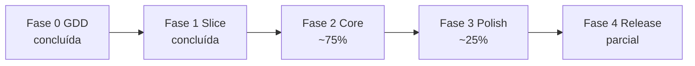

# Roadmap — Snaredusk

Fases de produção do GDD ao release jogável. Cada fase tem entregáveis, critérios de done e dependências.

---

## Visão geral



**Versão atual:** `v0.5.0` — [jogo público](https://lochesystem.github.io/snaredusk/)

**Estimativa restante Fase 2:** 2–3 semanas (1 dev, part-time ~20h/semana).

---

## Progresso por fase

| Fase | Status | Notas |
|------|--------|-------|
| 0 — GDD | 100% | Documentação completa |
| 1 — Vertical slice | 100% | Playtest 10/10 (2026-07-17) |
| 2 — Core loop | **~85%** | Tutorial, reputação e companheiro único completos; sentinelas seguem pendentes |
| 3 — Polish | **~55%** | Sprites v2+, UI customizada e tilesets/props dos três biomas em integração |
| 4 — Release | ~55% | Deploy + save ok; tutorial fluxo completo; polish visual em andamento |

---

## Fase 0 — GDD (concluída)

### Entregáveis

- [x] [README.md](../README.md) — pitch, controles, visão
- [x] [docs/GDD.md](GDD.md) — sistemas, números, catálogo
- [x] [docs/art-bible.md](art-bible.md) — perspectiva, pipeline visual
- [x] [docs/wall-tiles.md](wall-tiles.md) — pipeline técnico de paredes de masmorra
- [x] [docs/UX-UI.md](UX-UI.md) — wireframes, HUD, fluxos
- [x] [docs/ROADMAP.md](ROADMAP.md) — este documento

---

## Fase 1 — Vertical slice (concluída)

**Playtest:** 10/10 em 2026-07-17 — loop completo validado ([PLAYTEST.md](PLAYTEST.md)).

### Entregáveis

| Item | Status |
|------|--------|
| Projeto Vite + TS + PixiJS | Feito |
| Engine base (câmera, Y-sort, WASD + mouse) | Feito |
| 1 bioma — Floresta Fúngica | Feito |
| Masmorra procedural (grafo N/S/E/W) | Feito |
| Decor, obstáculos, baús, minimapa | Feito |
| Jogador (movimento, melee, HP) | Feito |
| 3 criaturas capturáveis | Feito |
| Captura (orbe, taxa por HP) | Feito |
| Loja básica + habitat + mercador de orbes | Feito |
| Save localStorage + deploy GitHub Pages | Feito |

---

## Fase 2 — Core loop completo (em progresso)

**Objetivo:** MVP jogável com todos os sistemas principais.

**Iniciado:** 2026-07-16 · **Última entrega:** `v0.5.0` (2026-07-23)

### Releases

| Versão | Data | Conteúdo principal |
|--------|------|-------------------|
| v0.3.2 | 2026-07-17 | Inventário grid, party (1 slot), hotbar de armas, desistir da masmorra (Esc) |
| v0.3.3–v0.3.6 | 2026-07-17 | 3 biomas + chefes, hazards, boss arena, chave, SFX, boss HUD 2 fases |
| v0.4.0 | 2026-07-18 | Base escavável, ciclo dia/noite, produção habitat |
| v0.4.1 | 2026-07-19 | Tutorial Mira MVP, mira de combate, reputação loja (níveis 1–3) |
| **v0.5.0** | **2026-07-23** | Tutorial PR2 (habitat/loja/orbes), sprites v2, loja visual, título redesenhado, rotação de estações, hitboxes |

### Entregáveis

| Sistema | Escopo GDD | Status | Notas |
|---------|------------|--------|-------|
| **3 biomas** | Floresta, Cristal, Termal + chefes | **Feito** | Desbloqueio em cadeia; tilesets v2 nos 3 biomas |
| **Boss fights** | Chefes únicos, arena, progressão | **Feito** | Arena, portão + chave, intro, 3 mecânicas, minions |
| **Hazards de bioma** | Esporos, gelo, veneno | **Feito** | Vinheta, inércia, poças de veneno |
| **Procedural** | 8–11 salas, 6 tipos de sala | **Feito** | Combate, tesouro, evento, descanso, mercador, chefe |
| **Combate variado** | Armas, projéteis, escudos, esquiva | **Forte** | Hotbar 1/2, stamina, Shift dash, 6 armas, mira de alcance |
| **Bolsa / inventário** | 12 slots + gestão | **Feito** | Grid redesenhado, descarte, modal na masmorra, aba Especiais |
| **Chave da arena** | Limpar fase → portão do chefe | **Feito** | Mata/captura todos → chave; some ao voltar à base |
| **Portal pós-chefe** | Só após baú épico | **Feito** | Não exige limpar masmorra inteira |
| **Loja** | 5 níveis, clientes, faixas | **Forte** | Tileset + props, clientes animados, reputação, painel bolsa recolhível |
| **Craft / oficina** | 20 receitas | **Feito (conteúdo MVP)** | 20 receitas, construções prontas, orbes, materiais e armas; armazenamento integrado da base |
| **Companheiro** | 1 companheiro ativo | **Feito (MVP)** | Escopo fechado em 1 slot para preservar clareza da ação; IA de idle, seguir e atacar |
| **Bestiário** | UI + bônus família | **Mínimo** | Registro no save + contador na base; sem tela dedicada |
| **Criaturas** | 18 espécies | **Feito** | **18/18** (5 capturáveis + chefe por bioma); sprites v1+ nos 3 biomas |
| **Loot** | 30 itens | **Feito** | **30/30** em `LOOT_TABLE` |
| **Receitas** | 20 receitas | **Feito** | **20/20** |
| **Ciclo dia/noite** | Dormir, loja, entardecer | **Parcial (MVP)** | Cama + `dayNumber`; 1 masmorra/dia; dormir após voltar ou fechar loja |
| **Sentinelas** | 1 por bioma, passivos | **Pendente** | — |
| **Base escavável** | Grid, escavação, baús, craft integrado | **Feito (v0.4)** | Tileset v2, estações v3, landmarks movíveis, rotação (R) |
| **Produção habitat** | Recursos passivos | **Parcial (MVP)** | Yield fixo por espécie; humor/fome depois |
| **Popularidade / reputação** | Níveis 1–3 | **Feito (MVP)** | Ouro vendido; +1 prateleira (nív. 2); colecionador (nív. 3) |
| **Tutorial** | 15 min com Mira | **Feito (fluxo)** | Masmorra → habitat → loja → orbes; skippável; fixes anti-softlock |

### Critérios de done

- [ ] 8–12 horas de conteúdo jogável (estimativa atual: ~4–6 h)
- [x] Todos os chefes derrotáveis com progressão de equipamento
- [ ] Economia sem inflação em 10 ciclos dia/noite (teste Vitest)
- [x] Habitat produz recursos (MVP: yield fixo ao dormir/fechar loja)
- [x] Reputação nível 1–3 alcançável
- [x] Tutorial completo sem softlocks conhecidos (validação contínua em playtest)
- [x] Suite Vitest abrangente (**268 testes**, 57 arquivos)

### Testes automatizados (Vitest) — estado atual

```
tests/
  biomes.test.ts           # biomas, desbloqueio, spawns
  bossMechanics.test.ts      # entrada na arena, portão
  dungeon.test.ts            # geração, walkability, sala boss
  tutorial.test.ts           # fluxo Mira, reputação, habitat
  reputation.test.ts         # níveis 1–3 da loja
  aimReticle.test.ts         # mira de combate
  enemyHitboxes.test.ts      # hitboxes por espécie
  tileRenderer.test.ts       # render de tiles
  shopDay.test.ts            # simulação de dia de loja
  baseBuild.test.ts          # colocação, rotação de estações
  habitatProduction.test.ts  # yield passivo
  dayCycle.test.ts           # endDay, flags masmorra/dia
  … (+ combat, craft, customers, etc.)

Pendente:
  economy.test.ts            # sinks de ouro em 10 ciclos
  save.test.ts               # migrações de save
```

---

## Fase 3 — Polish (2–3 semanas)

**Objetivo:** elevar qualidade visual e sonora ao nível da art bible.

### Entregáveis

| Área | Escopo | Status |
|------|--------|--------|
| **Arte jogador** | Sprites pintados + animações de ataque | **Parcial** | v2 idle/walk/attack implementados |
| **Arte base** | Tileset + estações + FX escavação | **Parcial** | tileset v2, estações v3, landmarks v3 |
| **Arte loja** | Tileset, props, clientes | **Parcial** | Tileset v1, clientes animados, tábuas no chão |
| **Arte biomas** | 3 biomas com criaturas e ambientação própria | **Parcial** | Floresta/Cristal/Termal com tilesets v2+; props temáticos e pedras integrados |
| **Tileset masmorra** | Paredes alinhadas (faixas 14 px) | Parcial (Floresta OK) |
| **Tela de título** | Arte + atmosfera | **Feito** | Background v2 |
| **Layout UI** | Fullscreen base/masmorra/loja | **Feito** | HUD overlay na loja |
| **Normal maps** | Jogador + props + criaturas | Pendente |
| **Iluminação** | Point lights por sala | Pendente |
| **Parallax** | 4 camadas por bioma | Pendente |
| **SFX / Música** | Web Audio + placeholders | **Parcial** | SFX combate/UI; música por bioma |
| **Boss HUD + fases** | Barra topo + 50% HP | **Feito** |
| **UI** | 9-slice panels, animações | Parcial |

---

## Fase 4 — Release (parcial)

| Item | Status |
|------|--------|
| URL pública ([GitHub Pages](https://lochesystem.github.io/snaredusk/)) | Feito |
| CI/CD GitHub Actions | Feito |
| Save persiste entre sessões | Feito |
| CHANGELOG.md | Feito |
| Tutorial para novo jogador | **Feito (fluxo)** — Mira guia masmorra → habitat → loja → orbes |
| Open Graph / GIF no README | Pendente |
| Console limpo (Chrome + Firefox) | Pendente |

---

## Fase 5 — Pós-release (backlog)

| Feature | Prioridade |
|---------|------------|
| Bioma 4 + chefe final ("Câmara do Véu") | Média |
| New Game+ | Baixa |
| Mais receitas (50+) | Baixa |
| APK Android | Fora de escopo |

---

## Próximas ações (prioridade)

1. ~~**Ciclo dia/noite jogável**~~ — MVP feito
2. ~~**Tutorial com Mira**~~ — fluxo completo (masmorra + habitat + loja + orbes)
3. ~~**Reputação na loja**~~ — níveis 1–3
4. ~~**Conteúdo**~~ — +6 criaturas, +13 loots, +18 receitas
5. ~~**Companheiro único**~~ — escopo fechado; IA e animações próprias
6. **Ambientação dos biomas** — densidade, composição e variedade de props
7. **Sentinelas** — decidir se permanecem no MVP
8. **Bestiário UI**
9. `economy.test.ts` — validar sinks de ouro
10. **Polish arte** — iluminação, parallax e consistência final

---

## Riscos ativos

| Risco | Mitigação |
|-------|-----------|
| Economia sem teste de 10 ciclos | Implementar `economy.test.ts` |
| Arte ainda mistura placeholder + v2 | Fase 3 focada em pipeline único por bioma |
| ROADMAP desatualizado | Revisar a cada release (última: v0.5.0) |

---

*Roadmap v0.7 — revisado 2026-07-24 (companheiro único como escopo final; ambientação dos biomas priorizada).*
