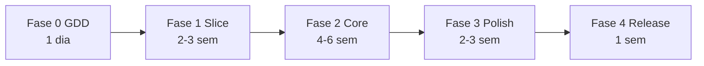
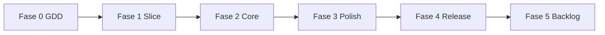

# Roadmap — Snaredusk

Fases de produção do GDD ao release jogável. Cada fase tem entregáveis, critérios de done e dependências.

---

## Visão geral



**Estimativa total:** 12–14 semanas (1 dev, part-time ~20h/semana).

---

## Fase 0 — GDD (concluída)

### Entregáveis

- [x] [README.md](../README.md) — pitch, controles, visão
- [x] [docs/GDD.md](GDD.md) — sistemas, números, catálogo
- [x] [docs/art-bible.md](art-bible.md) — perspectiva, pipeline visual
- [x] [docs/UX-UI.md](UX-UI.md) — wireframes, HUD, fluxos
- [x] [docs/ROADMAP.md](ROADMAP.md) — este documento

### Critérios de done

- [x] Core loop documentado com diagramas
- [x] 18 criaturas MVP catalogadas
- [x] Fórmulas de captura e precificação definidas
- [x] Perspectiva 2.5D especificada tecnicamente
- [x] Non-goals explícitos

---

## Fase 1 — Vertical slice (quase concluída)

**Objetivo:** provar que o core loop é divertido com placeholder art mínima.

### Entregáveis

| Item | Status |
|------|--------|
| Projeto Vite + TS + PixiJS | Feito |
| Engine base (câmera, Y-sort, WASD + mouse) | Feito |
| 1 bioma — Floresta Fúngica | Feito |
| Masmorra procedural (7–9 salas, grafo N/S/E/W) | Feito *(adiantou escopo)* |
| Decor, obstáculos (rochas/buracos), baús raros | Feito *(adiantou escopo)* |
| Minimapa (salas exploradas, portal) | Feito *(adiantou escopo)* |
| Jogador (movimento, melee, HP) | Feito |
| 3 criaturas capturáveis | Feito |
| Captura (orbe, taxa por HP) | Feito |
| Loja básica (3 prateleiras, 1 gaiola, faixas de preço) | Feito |
| Habitat visual na base (4 slots) | Feito *(adiantou escopo)* |
| Mercador de orbes na base | Feito *(adiantou escopo)* |
| Save localStorage | Feito |
| Deploy GitHub Actions + Pages público | Feito |

### Critérios de done

- [x] Loop masmorra → captura → venda → ouro
- [x] Save/load persiste entre sessões
- [x] Testes Vitest (captura, precificação, masmorra, habitat, orbShop)
- [x] URL pública funcional ([lochesystem.github.io/snaredusk/](https://lochesystem.github.io/snaredusk/))
- [ ] Playtest interno 10 min

### Fora da fase 1 (permanece para fase 2+)

- Biomas 2 e 3
- Tipos de sala (evento, descanso, loja ambulante, chefe)
- Sentinelas e party
- Craft completo
- Ciclo dia/noite jogável
- Iluminação com normal maps
- Áudio além de beeps

### Milestones técnicos

```
Semana 1: engine + movimento + masmorra + inimigos
Semana 2: captura + bolsa + transição base + procedural
Semana 3: loja + habitat + save + deploy + playtest
```

---

## Fase 2 — Core loop completo (em progresso)

**Objetivo:** MVP jogável com todos os sistemas principais.

**Iniciado:** 2026-07-16 — primeiro bloco: **loja completa** (parcial).

### Entregáveis

| Sistema | Escopo | Status |
|---------|--------|--------|
| **Loja completa** | 5 níveis upgrade, 6 arquétipos cliente, 4 faixas emoji | Parcial — níveis, clientes e faixas GDD; falta popularidade e display premium |
| **3 biomas** | Floresta, Cristal, Termal com chefes | Pendente |
| **Procedural** | 8–11 salas por run, tipos de sala (combate, tesouro, evento, descanso, mercador, chefe) | Parcial — tipos e chefe na run 1; biomas 2–3 pendentes |
| **Party** | 2 companheiros ativos, IA básica | Pendente |
| **Sentinelas** | 1 por bioma, 3 passivos implementados | Pendente |
| **Base** | Escavação, habitat, oficina, baús, craft adjacente | Pendente |
| **18 criaturas** | Todas capturáveis catalogadas no GDD | Pendente |
| **30 itens loot** | Tabela de valor base | Pendente |
| **20 receitas** | Orbes, armas, estações | Pendente |
| **Ciclo dia/noite** | Dormir, abrir loja, evento entardecer | Pendente |
| **Bestiário** | UI + bônus família completa | Pendente |
| **Tutorial** | 15 min com Mira | Pendente |

### Critérios de done

- [ ] 8–12 horas de conteúdo jogável (estimativa playtest)
- [ ] Todos os chefes derrotáveis com progressão de equipamento
- [ ] Economia sem inflação em 10 ciclos dia/noite (teste Vitest)
- [ ] Habitat produz recursos; craft consome de baús adjacentes
- [ ] Reputação nível 1–3 alcançável
- [ ] Zero softlocks conhecidos
- [ ] Testes Vitest: captura, precificação, dano, save

### Testes automatizados (Vitest)

```
tests/
  capture.test.ts      # fórmula de taxa
  pricing.test.ts      # faixas de reação
  dungeon.test.ts      # geração, walkability, portal
  habitat.test.ts      # bolsa ↔ habitat
  orbShop.test.ts      # compra de orbes
  customers.test.ts    # arquétipos de cliente
  shopUpgrade.test.ts  # níveis de loja
  shopDay.test.ts      # simulação de dia de loja
  combat.test.ts       # dano + tipos (fase 2)
  save.test.ts         # serialização (fase 2)
  economy.test.ts      # sinks de ouro (fase 2)
```

---

## Fase 3 — Polish (2–3 semanas)

**Objetivo:** elevar qualidade visual e sonora ao nível da art bible.

### Entregáveis

| Área | Escopo |
|------|--------|
| **Arte** | Sprites pintados bioma 1 completo; placeholders 2–3 |
| **Normal maps** | Jogador + 5 props + 3 criaturas |
| **Iluminação** | 4 point lights por sala, tochas dinâmicas |
| **Parallax** | 4 camadas por bioma |
| **Partículas** | Ambiente por bioma |
| **SFX** | Web Audio procedural + 10 one-shots |
| **Música** | 4 tracks loop (base, masmorra, loja, chefe) |
| **UI** | 9-slice panels, animações de feedback |
| **Balance** | Pass em dificuldade, preços, taxa captura |

### Critérios de done

- [ ] Art bible checklist 8/10 itens para bioma 1
- [ ] 60 FPS estável em hardware desktop típico
- [ ] Load < 3s em 4G
- [ ] Áudio mutável separado música/SFX
- [ ] Playtest externo (2+ pessoas) sem bugs bloqueantes

---

## Fase 4 — Release (em progresso)

**Objetivo:** publicar versão 1.0 jogável no GitHub Pages.

### Entregáveis

| Item | Descrição | Status |
|------|-----------|--------|
| README jogável | Link, controles, guia do slice | Feito |
| CI/CD | GitHub Actions → `lochesystem.github.io/snaredusk/` | Feito |
| CHANGELOG.md | v0.1.0 features | Feito |
| GDD §0 | Tabela implementado vs. meta | Feito |
| CONTINUIDADE-AGENTE.md | Handoff para sessões futuras | Pendente |
| Meta | Open Graph para compartilhamento | Pendente |
| README | GIF gameplay | Pendente |

### Critérios de done

- [x] URL pública funcional
- [ ] Novo jogador completa tutorial sem instruções externas
- [x] Save sobrevive refresh e fechar aba
- [ ] Sem erros no console em fluxo feliz (Chrome + Firefox desktop)

---

## Fase 5 — Pós-release (backlog, não comprometido)

| Feature | Prioridade | Notas |
|---------|------------|-------|
| APK Android (WebView) | Fora de escopo | Desktop web only |
| Bioma 4 + chefe final | Média | "Câmara do Véu" |
| New Game+ | Baixa | Preços ×5.6 estilo Moonlighter |
| PiP companion | Baixa | Padrão vinculo-vivo |
| Mais receitas (50+) | Baixa | Pós-feedback |
| Breeding | Muito baixa | Non-goal até validar core |

---

## Riscos e mitigações por fase

| Fase | Risco | Mitigação |
|------|-------|-----------|
| 1 | Engine oblíqua complexa | Reusar padrões de lotm-tactics (PixiJS) |
| 1 | Scope creep | Procedural e habitat entraram na fase 1; tipos de sala e biomas 2–3 ficam na fase 2 |
| 2 | 3 sistemas grandes | Implementar loja antes de base; base antes de bioma 3 |
| 2 | Balance quebrado | Vitest desde semana 1 da fase 2 |
| 3 | Arte demora | Composição modular de criaturas |
| 3 | Performance luzes | Limite 4 lights; fallback sem normal map |
| 4 | Deploy quebrado | CI desde fase 1 |

---

## Métricas de sucesso (pós-release)

| Métrica | Alvo v1.0 |
|---------|-----------|
| Tempo médio primeira sessão | ≥ 25 min |
| Taxa de conclusão tutorial | ≥ 70% |
| Retorno D7 (analytics opcional) | ≥ 20% |
| Bugs críticos reportados | 0 em 7 dias |
| Nota playtest interno | ≥ 7/10 |

---

## Dependências entre fases



**Regra:** não iniciar fase N+1 sem critérios de done da fase N (exceto polish paralelo de arte na fase 2).

---

## Próxima ação imediata

1. **Playtest** com [docs/PLAYTEST.md](PLAYTEST.md) (10 min) e preencher checklist
2. Fechar Fase 1 após playtest aprovado
3. Continuar Fase 2 — popularidade na loja, depois **base escavável** ou **bioma 2**

---

*Roadmap v0.3 — revisado 2026-07-16 (início Fase 2: loja).*
