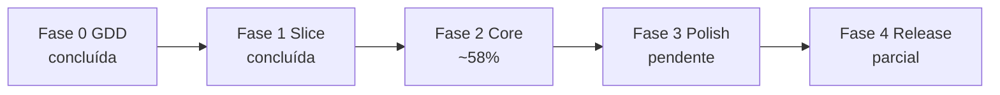

# Roadmap — Snaredusk

Fases de produção do GDD ao release jogável. Cada fase tem entregáveis, critérios de done e dependências.

---

## Visão geral



**Versão atual:** `v0.3.6` — [jogo público](https://lochesystem.github.io/snaredusk/)

**Estimativa restante Fase 2:** 3–4 semanas (1 dev, part-time ~20h/semana).

---

## Progresso por fase

| Fase | Status | Notas |
|------|--------|-------|
| 0 — GDD | 100% | Documentação completa |
| 1 — Vertical slice | 100% | Playtest 10/10 (2026-07-17) |
| 2 — Core loop | **~65%** | Base escavável + craft adjacente |
| 3 — Polish | ~5% | Placeholders funcionais |
| 4 — Release | ~40% | Deploy + save ok; tutorial e polish pendentes |

---

## Fase 0 — GDD (concluída)

### Entregáveis

- [x] [README.md](../README.md) — pitch, controles, visão
- [x] [docs/GDD.md](GDD.md) — sistemas, números, catálogo
- [x] [docs/art-bible.md](art-bible.md) — perspectiva, pipeline visual
- [x] [docs/wall-tiles.md](wall-tiles.md) — pipeline técnico de paredes de masmorra
- [x] [docs/UX-UI.md](UX-UI.md) — wireframes, HUD, fluxos
- [x] [docs/ROADMAP.md](ROADMAP.md) — este documento

---

## Fase 1 — Vertical slice (concluída)

**Playtest:** 10/10 em 2026-07-17 — loop completo validado ([PLAYTEST.md](PLAYTEST.md)).

### Entregáveis

| Item | Status |
|------|--------|
| Projeto Vite + TS + PixiJS | Feito |
| Engine base (câmera, Y-sort, WASD + mouse) | Feito |
| 1 bioma — Floresta Fúngica | Feito |
| Masmorra procedural (grafo N/S/E/W) | Feito |
| Decor, obstáculos, baús, minimapa | Feito |
| Jogador (movimento, melee, HP) | Feito |
| 3 criaturas capturáveis | Feito |
| Captura (orbe, taxa por HP) | Feito |
| Loja básica + habitat + mercador de orbes | Feito |
| Save localStorage + deploy GitHub Pages | Feito |

---

## Fase 2 — Core loop completo (em progresso)

**Objetivo:** MVP jogável com todos os sistemas principais.

**Iniciado:** 2026-07-16 · **Última entrega:** `v0.3.6` (2026-07-17)

### Releases v0.3.x

| Versão | Conteúdo principal |
|--------|-------------------|
| v0.3.2 | Inventário grid, party (1 slot), hotbar de armas, desistir da masmorra (Esc) |
| v0.3.3 | Desistir perde bolsa (mantém companheiro), HP do pet no HUD, fix bolsa na base |
| v0.3.4 | Bioma 2 Caverna de Cristal, seletor Destino na base, progressão por chefe |
| v0.3.5 | Bioma 3 Pântano Termal, cadeia completa dos 3 biomas |
| v0.3.6 | Boss fights (arena, portão, intro), chave da arena, hazards de bioma, aba Especiais na bolsa |

### Entregáveis

| Sistema | Escopo GDD | Status | Notas |
|---------|------------|--------|-------|
| **3 biomas** | Floresta, Cristal, Termal + chefes | **Feito** | Desbloqueio em cadeia, painel Destino, temas visuais |
| **Boss fights** | Chefes únicos, arena, progressão | **Feito** | Arena ampliada, portão + chave, intro cinematográfica, 3 mecânicas, minions |
| **Hazards de bioma** | Esporos, gelo, veneno | **Feito** | Vinheta (floresta), inércia (cristal), poças de veneno (termal) |
| **Procedural** | 8–11 salas, 6 tipos de sala | **Feito** | Combate, tesouro, evento, descanso, mercador, chefe |
| **Combate variado** | 3 armas, projéteis, escudos, esquiva | **Forte** | Hotbar 1/2, stamina, Shift dash, 3 armas craftáveis, IA ranged/shielded/boss |
| **Bolsa / inventário** | 12 slots + gestão | **Feito** | Grid, descarte, modal na masmorra, aba **Especiais** (itens da expedição) |
| **Chave da arena** | Limpar fase → portão do chefe | **Feito** | Mata/captura todos → chave; some ao voltar à base |
| **Portal pós-chefe** | Só após baú épico | **Feito** | Não exige limpar masmorra inteira |
| **Loja** | 5 níveis, clientes, faixas | **Parcial** | Níveis, 6 arquétipos, faixas emoji, 1 dia de loja/run; falta popularidade |
| **Craft / oficina** | 20 receitas | **Parcial** | Craft na bancada com baús adjacentes; modal de arsenal |
| **Party** | 2 companheiros ativos | **Parcial** | 1 slot com IA (seguir, atacar); falta 2º slot |
| **Bestiário** | UI + bônus família | **Mínimo** | Registro no save + contador na base; sem tela dedicada |
| **Criaturas** | 18 espécies | **Parcial** | **12/18** (3 capturáveis + chefe por bioma) |
| **Loot** | 30 itens | **Parcial** | **17/30** em `LOOT_TABLE` |
| **Receitas** | 20 receitas | **Parcial** | **2/20** |
| **Ciclo dia/noite** | Dormir, loja, entardecer | **Parcial (MVP)** | Cama + `dayNumber`; 1 masmorra/dia; dormir após voltar ou fechar loja |
| **Sentinelas** | 1 por bioma, passivos | **Pendente** | — |
| **Base escavável** | Grid, escavação, baús, craft adjacente | **Feito (v0.4)** | Hub canvas + barra inferior; modo Construir; stamina para escavar |
| **Produção habitat** | Recursos passivos | **Parcial (MVP)** | Yield fixo por espécie; humor/fome depois |
| **Popularidade / reputação** | Níveis 1–3 | **Feito (MVP)** | Ouro vendido; +1 prateleira (nív. 2); colecionador (nív. 3) |
| **Tutorial** | 15 min com Mira | **Parcial (MVP+)** | Masmorra + captura + habitat + loja + compra de orbes |

### Critérios de done

- [ ] 8–12 horas de conteúdo jogável (estimativa atual: ~3–5 h)
- [x] Todos os chefes derrotáveis com progressão de equipamento
- [ ] Economia sem inflação em 10 ciclos dia/noite (teste Vitest)
- [x] Habitat produz recursos (MVP: yield fixo ao dormir/fechar loja)
- [x] Reputação nível 1–3 alcançável
- [~] Zero softlocks conhecidos (portão/chefe/chave corrigidos em v0.3.6; validação contínua)
- [x] Suite Vitest abrangente (**150 testes**, 36 arquivos)

### Testes automatizados (Vitest) — estado atual

```
tests/
  biomes.test.ts         # biomas, desbloqueio, spawns
  bossMechanics.test.ts  # entrada na arena, portão
  dungeon.test.ts        # geração, walkability, sala boss
  dungeonSpecial.test.ts # chave da arena, fase limpa
  capture.test.ts        # fórmula de taxa
  combat.test.ts         # dano + tipos
  craft.test.ts          # receitas
  customers.test.ts      # arquétipos de cliente
  enemyAi.test.ts        # aggro
  habitat.test.ts        # bolsa ↔ habitat
  habitatProduction.test.ts  # yield passivo, overflow
  dayCycle.test.ts       # endDay, flags masmorra/dia
  inventory.test.ts      # descarte
  lootDrops.test.ts      # baús de inimigos
  orbShop.test.ts        # compra de orbes
  party.test.ts          # companheiro
  pricing.test.ts        # faixas de reação
  projectiles.test.ts    # projéteis
  shopDay.test.ts        # simulação de dia de loja
  shopUpgrade.test.ts    # níveis de loja
  baseDig.test.ts        # escavação
  baseBuild.test.ts      # colocação de estações
  adjacentCraft.test.ts  # craft com baús adjacentes
  … (+ weaponAttack, fxRunner, pointer, etc.)

Pendente:
  economy.test.ts        # sinks de ouro em 10 ciclos
  save.test.ts           # migrações de save
```

---

## Fase 3 — Polish (2–3 semanas)

**Objetivo:** elevar qualidade visual e sonora ao nível da art bible.

### Entregáveis

| Área | Escopo | Status |
|------|--------|--------|
| **Arte** | Sprites pintados bioma 1; placeholders 2–3 | Pendente |
| **Tileset masmorra** | Paredes alinhadas (faixas 14 px) — [wall-tiles.md](wall-tiles.md) | Parcial (Floresta OK) |
| **Normal maps** | Jogador + props + criaturas | Pendente |
| **Iluminação** | Point lights por sala | Pendente |
| **Parallax** | 4 camadas por bioma | Pendente |
| **Partículas** | Ambiente por bioma | Pendente |
| **SFX / Música** | Web Audio API + placeholders WAV | **Parcial** | SFX de combate, masmorra, captura, chefe e UI; música pendente |
| **Boss HUD + fases** | Barra topo + 50% HP | **Feito** | Nome, escudo, fase 2 com ataques escalados |
| **Animações de golpe (corpo)** | Atlas attack / Spine | Pendente | VFX telegraph no MVP |
| **UI** | 9-slice panels, animações | Parcial (boss intro, hotbar, abas bolsa) |
| **Balance** | Dificuldade, preços, captura | Contínuo |

---

## Fase 4 — Release (parcial)

| Item | Status |
|------|--------|
| URL pública ([GitHub Pages](https://lochesystem.github.io/snaredusk/)) | Feito |
| CI/CD GitHub Actions | Feito |
| Save persiste entre sessões | Feito |
| CHANGELOG.md | Feito |
| Tutorial para novo jogador | Parcial (MVP) — Mira na base + masmorra + captura |
| Open Graph / GIF no README | Pendente |
| Console limpo (Chrome + Firefox) | Pendente |

---

## Fase 5 — Pós-release (backlog)

| Feature | Prioridade |
|---------|------------|
| Bioma 4 + chefe final ("Câmara do Véu") | Média |
| New Game+ | Baixa |
| Mais receitas (50+) | Baixa |
| APK Android | Fora de escopo |

---

## Próximas ações (prioridade)

1. ~~**Ciclo dia/noite jogável**~~ — MVP: cama + `dayNumber` + loja reabre no novo dia
2. **Conteúdo** — +6 criaturas, +13 loots, +18 receitas
3. ~~**Produção habitat**~~ — MVP: yield fixo ao dormir/fechar loja (humor/fome depois)
4. **Party 2 slots** + **sentinelas**
5. **Bestiário UI** + **popularidade na loja**
6. **Tutorial** com Mira (15 min)
7. `economy.test.ts` — validar sinks de ouro

---

## Riscos ativos

| Risco | Mitigação |
|-------|-----------|
| Fase 2 scope creep (boss fights adiantados) | Roadmap atualizado; focar meta-progressão antes de mais features |
| Conteúdo fino (12/18 criaturas) | Próximo bloco: completar catálogo por bioma |
| Ciclo dia/noite bloqueia reputação e tutorial | Implementar antes de popularidade |
| ROADMAP desatualizado | Revisar a cada release v0.3.x |

---

*Roadmap v0.5 — revisado 2026-07-17 (v0.4: base escavável, baús, craft adjacente).*
