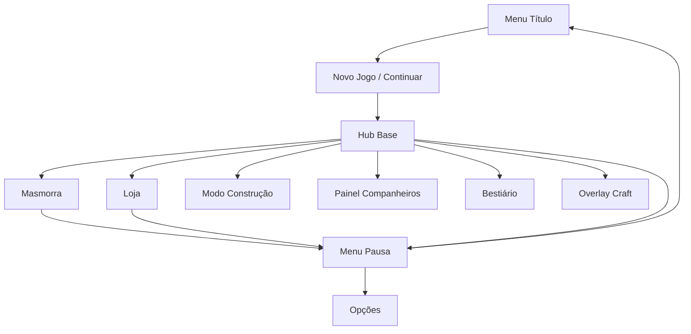
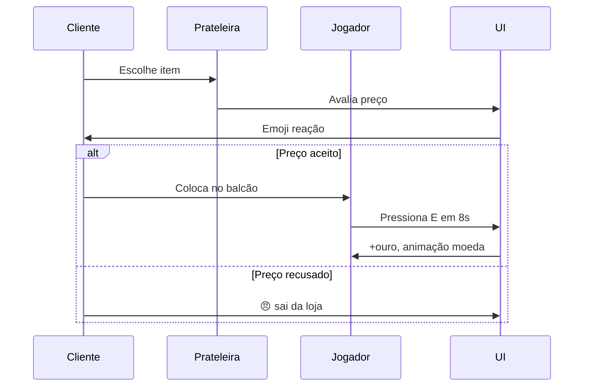

# UX/UI — Snaredusk

Wireframes textuais, fluxos de tela, HUD, princípios de usabilidade e acessibilidade.

---

## 1. Princípios de UX

| Princípio | Aplicação |
|-----------|-----------|
| **Clareza em 3 segundos** | Jogador sempre sabe: onde está, HP/ouro, próximo objetivo |
| **Máximo 2 níveis de menu** em combate/exploração | Bolsa e mapa são overlays; não há submenu de submenu |
| **Feedback imediato** | Toda ação tem resposta visual + sonora em < 100ms |
| **Mouse + teclado** | Controles exclusivos desktop; mira pelo cursor |
| **Fail soft** | Ações inválidas explicam *por quê* ("Bolsa cheia", "HP do alvo muito alto") |
| **Cozy, não punishing** | Morte explica o que foi perdido vs. mantido |

### Hierarquia de informação (masmorra)

```
1. HP / Stamina (crítico)
2. Inimigos e dano
3. Bolsa (slots livres)
4. Minimapa
5. Ouro da run
6. Cooldown habilidade
```

---

## 2. Mapa de telas



---

## 3. Menu título

```
┌─────────────────────────────────────────────┐
│                                             │
│            SNAREDUSK                          │
│         (logo pixel animado)                │
│                                             │
│         ┌─────────────────┐                 │
│         │   CONTINUAR     │  (se save)      │
│         └─────────────────┘                 │
│         ┌─────────────────┐                 │
│         │   NOVO JOGO     │                 │
│         └─────────────────┘                 │
│         ┌─────────────────┐                 │
│         │    OPÇÕES       │                 │
│         └─────────────────┘                 │
│                                             │
│     v0.1 · LochéSystem                      │
└─────────────────────────────────────────────┘
```

**Opções:** volume música/SFX, fullscreen, exportar/importar save, créditos.

---

## 4. Hub da base

### Layout desktop

```
┌──────────────────────────────────────────────────────────┐
│ [☰]  Ouro: 1.240    Dia 3 · Tarde    [👥] [📖] [⚙]      │
├──────────────────────────────────────────────────────────┤
│                                                          │
│              (viewport do jogo — câmera livre)          │
│                                                          │
│                    [personagem]                          │
│              habitat    oficina    loja                  │
│                                                          │
├──────────────────────────────────────────────────────────┤
│ [🔨 Construir]  [💤 Dormir]  [🌙 Masmorra]  [🏪 Loja]   │
└──────────────────────────────────────────────────────────┘
```

### Barra inferior — ações contextuais

| Botão | Função |
|-------|--------|
| 🔨 Construir | Toggle modo construção |
| 💤 Dormer | Avança para próximo dia (confirmação) |
| 🌙 Masmorra | Abre seleção de bioma + party |
| 🏪 Loja | Entra no interior da loja |

### Modo construção

```
┌──────────────────────────────────────────────────────────┐
│ MODO CONSTRUÇÃO                    [X Sair]              │
├──────────────────────────────────────────────────────────┤
│                                                          │
│         (grid overlay 32×32 semi-transparente)         │
│         fantasma do item segue cursor                    │
│                                                          │
├──────────────────────────────────────────────────────────┤
│ Categorias: [Paredes] [Pisos] [Estações] [Decoração]   │
│ ┌────┐ ┌────┐ ┌────┐ ┌────┐ ┌────┐                      │
│ │wall│ │floor│ │bench│ │chest│ │torch│  ← scroll horizontal│
│ └────┘ └────┘ └────┘ └────┘ └────┘                      │
│ Madeira: 24    Ferro: 8    [Rotacionar R]                │
└──────────────────────────────────────────────────────────┘
```

**Regras UX:**

- Verde = pode colocar; vermelho = bloqueado
- Clique direito / toque longo = remover (modo demolição)
- ESC sai do modo construção sem perder seleção

---

## 5. Masmorra — HUD

### Desktop

```
┌──────────────────────────────────────────────────────────┐
│ ♥♥♥♥♥♡♡♡♡♡  78/100    ⚡████████░░  64/80               │
│                                                          │
│                                                          │
│              (viewport gameplay)                         │
│                                                          │
│                                                          │
├──────────────────────────────────────────────────────────┤
│ [Q Orbe x3]  [Space ⚡ 4s]     Bolsa: ████████░░ 8/12   │
│                              ┌────────┐                  │
│                              │ minimap│                  │
│                              └────────┘                  │
└──────────────────────────────────────────────────────────┘
```

### Overlay de captura

Quando alvo está capturável (HP ≤ 25%):

```
        ┌─────────────────────┐
        │  CAPTURÁVEL!       │
        │  [Q] Orbe de Vínculo│
        │  Taxa: ~45%        │
        └─────────────────────┘
              ↑
         [monstro piscando borda verde]
```

### Overlay de bolsa (tecla I)

```
┌─────────────────────────────────────┐
│ BOLSA                          [X]  │
├─────────────────────────────────────┤
│ ┌──┐ ┌──┐ ┌──┐ ┌──┐ ┌──┐ ┌──┐     │
│ │🍄│ │⚗│ │  │ │🦇│ │  │ │  │     │
│ │x5│ │x2│ │  │ │x1│ │  │ │  │     │
│ └──┘ └──┘ └──┘ └──┘ └──┘ └──┘     │
│ ┌──┐ ┌──┐ ┌──┐ ┌──┐ ┌──┐ ┌──┐     │
│ │  │ │  │ │  │ │  │ │  │ │  │     │
│ └──┘ └──┘ └──┘ └──┘ └──┘ └──┘     │
├─────────────────────────────────────┤
│ Hover: Esporo brilhante — Valor ~45 │
└─────────────────────────────────────┘
```

---

## 6. Loja

### Modo gerenciamento (antes de abrir)

```
┌──────────────────────────────────────────────────────────┐
│ LOJA — Gerenciamento              Ouro: 1.240    [X]   │
├──────────────────────────────────────────────────────────┤
│  DEPÓSITO          │  PRATELEIRAS                      │
│  ┌──┐ ┌──┐ ┌──┐    │  ┌─────┐ ┌─────┐ ┌─────┐         │
│  │🍄│ │⚗│ │🦇│    │  │ 🍄  │ │     │ │ 🦇  │         │
│  └──┘ └──┘ └──┘    │  │ 65g │ │     │ │ ??? │         │
│  (arrastar →)      │  └─────┘ └─────┘ └─────┘         │
│                    │  Gaiola: [lumimorcego] humor 😊   │
├──────────────────────────────────────────────────────────┤
│  [DEFINIR PREÇO]  [ABRIR LOJA]  [DECORAR]              │
└──────────────────────────────────────────────────────────┘
```

### Definir preço (modal)

```
┌─────────────────────────────────────┐
│ Esporo brilhante                    │
│ Valor descoberto: ~45 ouro          │
├─────────────────────────────────────┤
│ Preço:  [ − ]  52  [ + ]           │
│                                     │
│ Simulação: provável 😊 Perfeito     │
│                                     │
│ Popularidade: ████████░░ 72         │
├─────────────────────────────────────┤
│        [CANCELAR]  [CONFIRMAR]      │
└─────────────────────────────────────┘
```

### Modo balcão (loja aberta)

```
┌──────────────────────────────────────────────────────────┐
│ LOJA ABERTA — Fila: 3 clientes                           │
├──────────────────────────────────────────────────────────┤
│                                                          │
│    [Cliente 1]  😊  →  [BALCÃO]  ←  [VOCÊ]             │
│                         [🍄]                             │
│                    [E] Vender 52g                        │
│                                                          │
│    [Cliente 2 aguardando...]                             │
│                                                          │
├──────────────────────────────────────────────────────────┤
│ Caixa hoje: +186 ouro    Satisfação média: 😊            │
└──────────────────────────────────────────────────────────┘
```

**Timer balcão:** barra circular 8s ao redor do item; fica vermelha nos últimos 2s.

### Fluxo de venda



---

## 7. Painel de companheiros e sentinelas

```
┌──────────────────────────────────────────────────────────┐
│ COMPANHEIROS E SENTINELAS                           [X]  │
├──────────────────────────────────────────────────────────┤
│  PARTY (máx 2)           │  SENTINELAS POR BIOMA         │
│  ┌────┐  ┌────┐          │  Floresta: [Lumimorcego] 🔦   │
│  │ 🦇 │  │ 🍄 │          │  Cristal:  [ — vazio — ]     │
│  │Lv3 │  │Lv1 │          │  Termal:   [ — vazio — ]     │
│  └────┘  └────┘          │                               │
├──────────────────────────────────────────────────────────┤
│  HABITAT (clique para detalhe)                           │
│  ┌────┐ ┌────┐ ┌────┐ ┌────┐ ┌────┐ ┌────┐             │
│  │ 🦇 │ │ 🍄 │ │ 🦀 │ │ +  │ │ +  │ │ +  │             │
│  │ 😊 │ │ 😐 │ │ 💤 │ │    │ │    │ │    │             │
│  └────┘ └────┘ └────┘ └────┘ └────┘ └────┘             │
├──────────────────────────────────────────────────────────┤
│  [IR À MASMORRA]                                         │
└──────────────────────────────────────────────────────────┘
```

### Detalhe de criatura (slide-in)

```
┌─────────────────────────────────────┐
│ Lumimorcego          Incomum · Luz  │
│ Lv 3  HP 45  ATK 8                  │
├─────────────────────────────────────┤
│ Habilidade: Pulso luminescente (8s) │
│ Passivo bioma: Revela salas secretas│
│ Produção: 2× pó luminescente/dia    │
├─────────────────────────────────────┤
│ Humor: 😊 82   Fome: ████░ fedido   │
├─────────────────────────────────────┤
│ [PARTY] [SENTINELA] [GAIOLA] [SOLTAR]│
└─────────────────────────────────────┘
```

---

## 8. Seleção de masmorra

```
┌──────────────────────────────────────────────────────────┐
│ PARA ONDE?                                          [X]  │
├──────────────────────────────────────────────────────────┤
│  ┌──────────────┐  ┌──────────────┐  ┌──────────────┐   │
│  │ 🍄 FLORESTA  │  │ 💎 CRISTAL   │  │ ♨ TERMAL     │   │
│  │  Nível 2     │  │  Nível 1 🔒* │  │  Nível 0 🔒  │   │
│  │  [ENTRAR]    │  │  Precisa chave│  │  Precisa chave│  │
│  └──────────────┘  └──────────────┘  └──────────────┘   │
├──────────────────────────────────────────────────────────┤
│  Party: [🦇] [🍄]     Sentinela ativa: Lumimorcego       │
│  Arma: Picareta T2    Orbes: 3                          │
│                    [CONFIRMAR]                           │
└──────────────────────────────────────────────────────────┘
```

---

## 9. Bestiário

```
┌──────────────────────────────────────────────────────────┐
│ BESTIÁRIO  12/18                              [X]        │
├──────────────────────────────────────────────────────────┤
│ Filtro: [Todos] [Floresta] [Cristal] [Termal]            │
│                                                          │
│ ┌────┐ ┌────┐ ┌────┐ ┌────┐ ┌────┐ ┌────┐              │
│ │ 🦇 │ │ ?  │ │ 🍄 │ │ 🦀 │ │ ?  │ │ 💎 │              │
│ │ ✓  │ │    │ │ ✓  │ │ ✓  │ │    │ │ ✓  │              │
│ └────┘ └────┘ └────┘ └────┘ └────┘ └────┘              │
├──────────────────────────────────────────────────────────┤
│ Lumimorcego — capturado 3× — passivo: revela segredos    │
│ Fraqueza: Água · Resistência: Luz                        │
└──────────────────────────────────────────────────────────┘
```

---

## 10. Overlay de craft

```
┌──────────────────────────────────────────────────────────┐
│ OFICINA — Bancada                                   [X]  │
├──────────────────────────────────────────────────────────┤
│ RECEITAS          │  PREVIEW                             │
│ > Orbe Vínculo    │  ┌────┐                              │
│   Orbe Reforçado  │  │ 🔮 │  Orbe de Vínculo             │
│   Tocha           │  └────┘                              │
│   Comedouro       │  2× fibra + 1× pó luminescente       │
│                   │  (armazenamento da base: ✓)          │
├──────────────────────────────────────────────────────────┤
│                              [CRAFTAR]                   │
└──────────────────────────────────────────────────────────┘
```

---

## 11. Tutorial (primeiros 15 min)

| Minuto | Evento | UI |
|--------|--------|-----|
| 0–2 | Mira apresenta base | Dialog box com retrato |
| 2–5 | Primeira masmorra (1 sala) | Seta no movimento; highlight inimigo |
| 5–8 | Primeira captura | Highlight tecla Q; barra HP inimigo |
| 8–11 | Primeira venda | Força modo balcão; Mira explica emoji |
| 11–13 | Primeiro habitat | Arrastar criatura para slot |
| 13–15 | Primeiro craft de orbe | Abre oficina; highlight bancada |

**Regra:** tutorial skippável após primeira captura para veteranos.

---

## 12. Feedback e microinterações

| Evento | Visual | Sonoro |
|--------|--------|--------|
| Dano recebido | Flash vermelho 100ms, screen shake 2px | Impacto grave |
| Crítico | Número amarelo maior, shake 4px | Pitch alto |
| Captura sucesso | Flash branco, estrelas, freeze 300ms | Chime ascendente |
| Captura falha | X vermelho, monstro pulsa | Buzz |
| Venda perfeita | Moedas flutuam para HUD ouro | Ka-ching |
| Cliente irritado | Emoji 😠 bounce + nuvem cinza | Tom descendente |
| Item craftado | Sparkle no item | Martelo |
| Level up criatura | Banner "LEVEL UP!" 1s | Fanfarra curta |
| Bolsa cheia | Banner vermelho "BOLSA CHEIA" | Thud |

---

## 13. Acessibilidade

| Recurso | Implementação |
|---------|---------------|
| Daltonismo | Ícones de tipo elemental com forma + cor |
| Tamanho de fonte | Opção 100% / 125% / 150% |
| Reduzir flash | Toggle desliga screen flash |
| Reduzir shake | Toggle desliga screen shake |
| Alto contraste UI | Borda branca 2px em painéis |
| Teclado completo | Todas as ações mapeáveis (fase 2) |
| Pausa | Esc congela gameplay sempre |

---

## 14. Estados de erro e empty

| Situação | Mensagem | Ação sugerida |
|----------|----------|---------------|
| Bolsa cheia | "Bolsa cheia — libere um slot" | Abrir bolsa |
| Sem orbes | "Sem Orbes de Vínculo" | Link craft |
| Criatura não capturável | "Esta criatura não pode ser capturada" | — |
| HP alto demais | "Enfraqueça o alvo primeiro (HP ≤ 25%)" | — |
| Loja sem estoque | "Coloque itens nas prateleiras" | Modo gerenciamento |
| Habitat cheio | "Habitat cheio — expanda ou venda" | Modo construção |

---

## 15. Layout e resolução

| Resolução lógica | Comportamento |
|------------------|---------------|
| **480×270** (base) | Canvas interno pixel-perfect |
| **Scale 2×–4×** | Integer scaling centralizado na janela |
| **Janela redimensionável** | Letterbox mantém aspect ratio 16:9 |

**Mínimo recomendado:** 960×540 px de janela (scale 2×). Sem layout alternativo para telas pequenas — o jogo é desktop-only.

---

*UX/UI v0.1 — complementa [GDD.md](GDD.md) e [art-bible.md](art-bible.md).*
